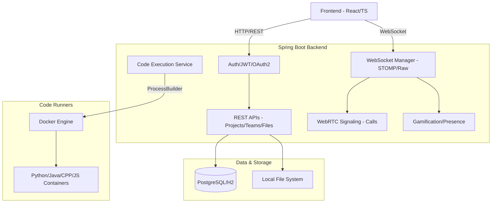

# Parallax

Parallax is a premium, full-stack collaborative development platform designed for modern engineering teams. It integrates shared coding sessions, real-time communication, project coordination, and instant code execution into a single, cohesive experience.

## Key Features

### 🚀 Real-time Collaborative Coding
*   **Shared Workspace**: Multi-file editing powered by **Monaco Editor** (the engine behind VS Code).
*   **Conflict Resolution**: Operational Transformation (OT) inspired synchronization logic ensures code consistency across all participants.
*   **Live Cursors**: Track teammates' movements and selections in real-time with zero-latency visual feedback.

### 💬 Unified Chat System
*   **Project Chat**: Persistent, high-performance WebSocket channels dedicated to specific coding projects.
*   **Team Chat**: Workspace-wide communication for coordination across multiple projects.
*   **Direct Messaging**: Secure, peer-to-peer messaging for private collaboration.

### 📞 Voice & Video Calling
*   **WebRTC Integration**: Low-latency, peer-to-peer media streams for voice and video communication.
*   **Signaling Engine**: Custom signaling implementation using STOMP/WebSockets to coordinate call offers, answers, and ICE candidates.
*   **In-IDE Presence**: Start and join calls directly within the coding environment.

### 🏆 Gamification & Productivity Tracking
*   **XP & Leveling**: Earn experience points for code commits, project creations, and collaboration milestones.
*   **Achievement System**: Unlock badges (e.g., "Century Club", "Streak Master") based on contribution streaks and platform activity.
*   **Contribution Heatmap**: Visual activity tracking inspired by GitHub's contribution graph.

### ⚙️ Isolated Code Execution
*   **Docker Orchestration**: Pluggable runner architecture that spawns isolated containers for Python, Java, C++, and JavaScript.
*   **Streaming Logs**: Standard output and error streams are captured and pushed to the frontend terminal in real-time.

### 👥 Advanced Team Management
*   **Hierarchical Permissions**: Manage roles across Teams, Projects, and individual files.
*   **Versioning Support**: Full branch management, commit history, and Merge Request (MR) workflows.

## Architecture Overview



## Repository Structure

- `Parallax-Frontend/frontend`: React + TypeScript + Vite web application using Tailwind CSS 4.
- `Parallax-Backend/backend`: Spring Boot backend service handling auth, persistence, and real-time channels.
- `Parallax-Backend/parallax-python-runner`: Isolated runner infrastructure for code execution.
- `Design/`: UI/UX design artifacts and platform assets.

## Prerequisites

- **Java**: 17+
- **Node.js**: 18+ (npm 9+)
- **Docker**: Required for local code runner workflows
- **Environment**: Local `.env` files for both Frontend and Backend

## Quick Start (Local Development)

### 1) Start Backend

Navigate to `Parallax-Backend/backend`:

```bash
# macOS/Linux
./mvnw spring-boot:run

# Windows
.\mvnw.cmd spring-boot:run
```

Default backend URL: `http://localhost:8080`

### 2) Start Frontend

Navigate to `Parallax-Frontend/frontend`:

```bash
npm install
npm run dev
```

Default frontend URL: `http://localhost:3000`

## Module Documentation

- **Frontend Setup**: See [Parallax-Frontend/README.md](Parallax-Frontend/README.md) for UI configuration and service layers.
- **Backend Setup**: See [Parallax-Backend/README.md](Parallax-Backend/README.md) for API details, WebSocket configuration, and Auth setup.
- **Scaling Roadmap**: See [ARCHITECTURE_ROADMAP.md](ARCHITECTURE_ROADMAP.md) for production scaling strategies.

## Suggested Development Workflow

1. Start backend and verify health at `http://localhost:8080/api/health`.
2. Start frontend and verify landing page load.
3. Test OAuth login (Google/GitHub) and JWT persistence.
4. Validate real-time features (Workspace sync, Chat, Calls).
5. Build both modules before submitting pull requests.

## Contributing

1. Create a feature branch.
2. Synchronize frontend and backend changes for API contract updates.
3. Validate changes across primary dashboards and workspace flows.
4. Run full build/test suites locally.

## License

Refer to repository-level licensing and module notices for policy details.
