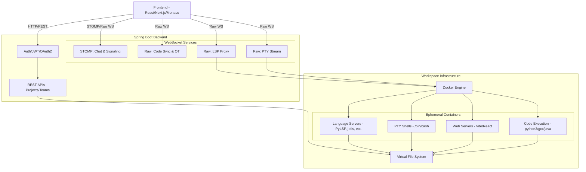

# Parallax — Premium Collaborative Development Platform

A full-stack collaborative engineering environment that merges real-time code editing, secure peer-to-peer communication, true PTY terminal access, and isolated code execution into a single unified workspace.

--- 
> 

---

## Table of Contents

- [Problem Statement](#problem-statement)
- [Problem Solution](#problem-solution)
- [Project Description](#project-description)
- [Architecture](#architecture)
- [Key Features](#key-features)
- [Project Scope](#project-scope)
- [How to Start on Your Local PC](#how-to-start-on-your-local-pc)
- [Contribution Guidelines](#contribution-guidelines)

---

## Problem Statement

Modern software engineering teams are increasingly distributed, yet the tools they use remain deeply fragmented. Developers often struggle with:

- **Context Switching** — Constantly jumping between code editors (VS Code), communication tools (Slack/Discord), and video conferencing (Zoom/Google Meet) breaks focus.
- **Friction in Pair Programming** — Screen sharing is non-interactive. Setting up live-share extensions often requires everyone to have the exact same IDE and environment configurations.
- **Environment Discrepancies** — "It works on my machine" remains a persistent issue during collaborative debugging. 
- **Disconnected Workflows** — Chatting about a specific line of code or running a quick script requires copying, pasting, and manually syncing environments across team members.

There is a critical need for a unified platform that natively combines the code, the execution environment, and the team communication into one seamless browser-based experience.

---

## Problem Solution

We built **Parallax** to be the ultimate virtual workspace for engineering teams:

| Problem | Our Solution |
|---------|-------------|
| Context Switching | A **Unified Interface** that places your IDE, project file tree, chat, and voice/video calling in a single browser tab. |
| Friction in Pair Programming | A **Shared Workspace** powered by Monaco Editor (the engine behind VS Code) with real-time Operational Transformation (OT) sync, allowing multiple developers to type simultaneously with live cursor tracking. |
| Environment Discrepancies | **Isolated Code Execution & VFS** powered by pluggable Docker containers and a true Virtual File System. Code is executed server-side in identical sandboxes ensuring consistent results. |
| Disconnected Workflows | **Integrated Communication** featuring persistent Project Chat, Workspace Team Chat, Direct Messaging, and WebRTC-powered voice/video calls built directly into the IDE. |

---

## Project Description

Parallax is a modern, premium web application built on a robust Java Spring Boot backend and a high-performance React frontend. It leverages WebSockets for sub-millisecond collaboration sync, WebRTC for peer-to-peer media, and Docker for scalable containerized sandboxes.

---

## Architecture

Parallax uses a sophisticated architecture to blend real-time collaboration with isolated container management.



---

## Key Features

- **Real-time Collaborative Coding:** Multi-file editing, OT-based conflict resolution, and zero-latency live cursors.
- **Language Server Protocol (LSP) Integration:** True IDE intelligence (autocomplete, linting, hover definitions) in the browser for Python, Java, JS/TS, C, and C++.
- **True PTY Terminals:** Fully interactive WebSockets-based terminals connected directly to workspace Docker containers.
- **Git Integration:** Native UI for branching, committing, and pushing code directly to remote repositories.
- **Web Project Execution:** Spin up React, Next.js, and Vanilla web servers inside the workspace container and view them in a live Browser Preview panel.
- **Unified Chat System:** Persistent WebSockets for Project Chat, Team Chat, and secure peer-to-peer Direct Messaging with emoji reactions and attachments.
- **Voice & Video Calling:** Native WebRTC integration for low-latency peer-to-peer media streams, coordinated via a custom STOMP signaling engine.
- **Advanced Team Management:** Hierarchical RBAC (Role-Based Access Control) across Teams, Projects, and individual files.

---

## Project Scope

### In Scope

- Real-time multi-user code editing with conflict resolution.
- Secure, sandboxed code execution for major languages.
- Full IDE capabilities (LSP, Terminals, File Explorer).
- Comprehensive chat system (Project, Team, DM).
- Peer-to-peer WebRTC video and audio calling.
- Team and project lifecycle management with strict access controls.
- OAuth2 authentication and user profile gamification.
- Full-stack web development previews.

### Out of Scope (Future Work)

- Kubernetes-based horizontal scaling for the code runners (currently Docker standalone).
- End-to-end encryption for stored chat messages.
- Mobile-native applications (iOS/Android).

---

## How to Start on Your Local PC

### Prerequisites

- **Java**: 21
- **Node.js**: 18+ (npm 9+)
- **Docker**: Required and must be running for local code runner execution.

### Quick Start 

**1. Create environment files**

`backend/backend/.env` (Copy from `.env.example`):
```env
JWT_SECRET=your_super_secret_jwt_key_here
GOOGLE_CLIENT_ID=your_google_client_id
GOOGLE_CLIENT_SECRET=your_google_client_secret
GITHUB_CLIENT_ID=your_github_client_id
GITHUB_CLIENT_SECRET=your_github_client_secret
```

`frontend/.env.local` (Copy from `.env.example`):
```env
VITE_API_BASE_URL=http://localhost:8080
VITE_WS_BASE_URL=ws://localhost:8080
VITE_OAUTH_BASE_URL=http://localhost:8080
```

**2. Start the Backend**

Open a terminal and navigate to the backend directory:
```bash
cd backend/backend

# macOS/Linux
./mvnw spring-boot:run "-Dmaven.test.skip=true"

# Windows
.\mvnw.cmd spring-boot:run "-Dmaven.test.skip=true"
```
*The backend will be available at http://localhost:8080*

**3. Start the Frontend**

Open a second terminal and navigate to the frontend directory:
```bash
cd frontend

npm install
npm run dev
```
*The frontend will be available at http://localhost:3000*

---

## Contribution Guidelines

We welcome contributions to make Parallax even better! 

### Development Workflow

1. **Fork & Clone**: Fork the repository and clone it locally.
2. **Branch**: Create a feature branch (`git checkout -b feature/amazing-feature`).
3. **Commit**: Write descriptive commit messages.
4. **Push & Pull Request**: Push your branch and open a PR against `main`.

### Code Style

- **Frontend**: Follow functional React patterns, strict TypeScript typing, and Tailwind utility class conventions.
- **Backend**: Adhere to standard Java naming conventions, utilize Lombok to reduce boilerplate, and keep business logic isolated within `@Service` classes.
- **Testing**: Use JUnit 5 and Mockito. All new services must include unit tests for primary happy and unhappy paths.

### Reporting Issues

Use GitHub Issues to report bugs or request features. Please include environment details, steps to reproduce, and any relevant error logs or screenshots.

---

*Refer to the repository-level licensing notices for policy details.*
